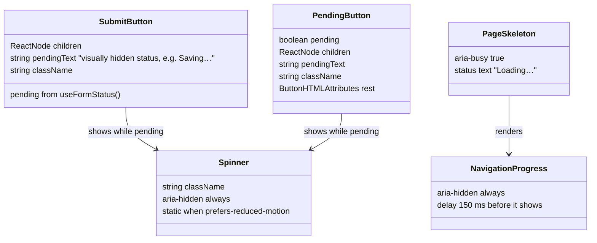

# Pending feedback: data shapes

Milestones: PMA-M12 · Updated: 2026-10-03

Nothing is stored: this feature changes no record, table, file or MCP tool. What crosses a boundary is the props of the
shared UI pieces in `src/components/ui.tsx`, which every call site in use-cases.md reuses instead of styling its own.

| Piece | Used by | Rules |
| --- | --- | --- |
| `Spinner` | `SubmitButton`, `PendingButton`, the status select | `aria-hidden`; its animation stops under `prefers-reduced-motion: reduce` (PF-1.6) |
| `SubmitButton` | forms whose `action` is a server action: login, sign-up, log out, log time, comment, add repo, create key | Must sit inside the `<form>`; reads `useFormStatus().pending`. Disabled, `aria-busy`, spinner and a `role="status"` visually hidden `pendingText` while pending (PF-1.1, PF-1.5) |
| `PendingButton` | controls driven by `useTransition` / `useActionState`: Delete, Remove, Revoke, Retry now, Reload, record Save (its form submits in `onSubmit` through `useActionState`, so `useFormStatus` never sees it) | Same look as `SubmitButton`, with `pending` passed in (PF-1.2) |
| `PageSkeleton` | `src/app/(app)/loading.tsx` | `aria-busy="true"`, visually hidden "Loading…" status (PF-2.1, PF-2.4) |
| `NavigationProgress` | the `(app)` layout, started by `onRouterTransitionStart` in `src/instrumentation-client.ts`; also rendered by `PageSkeleton` | `aria-hidden`; shows only after 150 ms (PF-2.5) and hides when the new URL commits and no skeleton is showing (PF-2.2) |

`src/components/auth-form.tsx`'s own `SubmitButton` is replaced by the shared one.
