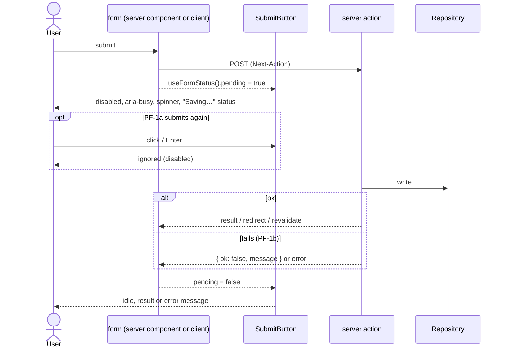
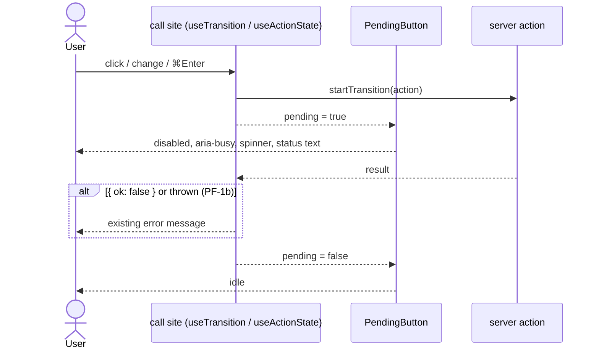
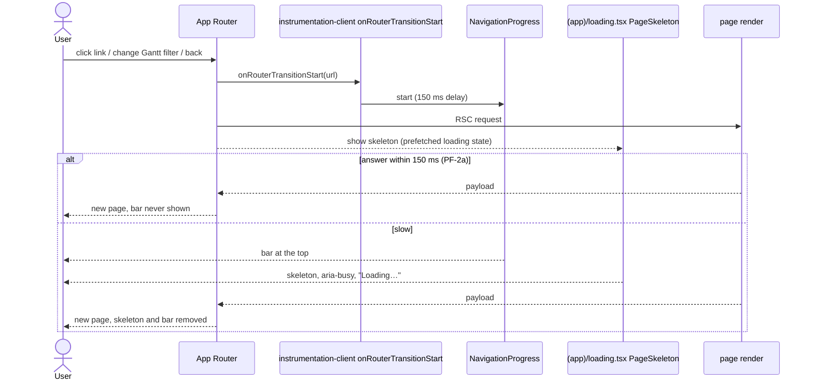

# Pending feedback: sequences

Milestones: PMA-M12 · Updated: 2026-10-03

## PF-1 Run an action: a form

Login, sign-up, log out, log time, comment, add repo, create key.



## PF-1 Run an action: an inline control

Status select, Delete, Remove, Revoke, Retry now, Reload, record Save.



## PF-2 Open another page



## PF-3 Refresh the page

```mermaid
sequenceDiagram
  actor User
  participant Btn as RefreshButton (header)
  participant Router as App Router
  participant Server as page render
  User->>Btn: click / press r (not in a field)
  Btn->>Router: startTransition(router.refresh())
  Btn-->>User: disabled, aria-busy, spinner, "Refreshing…" status
  Router->>Server: RSC request (no document reload)
  Server-->>Router: fresh payload
  Router-->>User: server components updated; client state (filters, scroll, editor draft) kept
  Btn-->>User: idle, "Updated just now"
```
