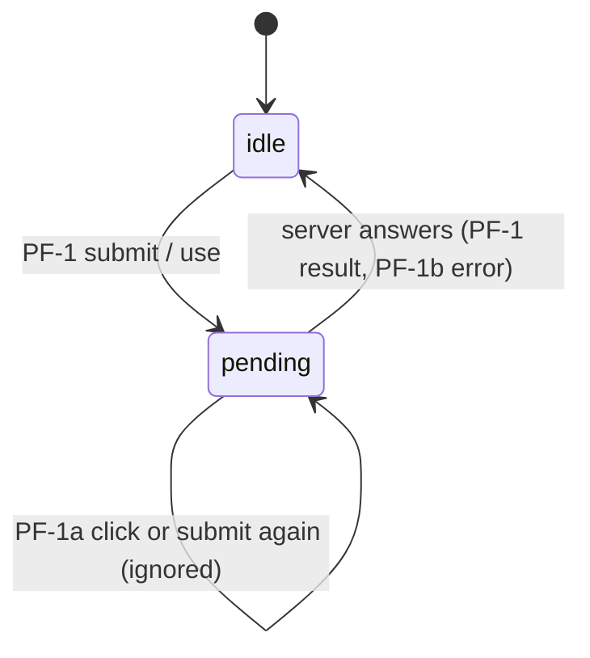
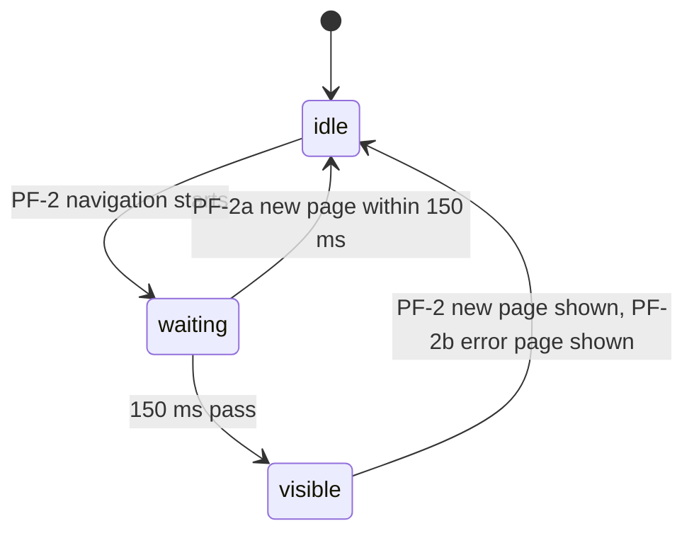

# Pending feedback: states

Milestones: PMA-M12 · Updated: 2026-10-03

No stored record has a lifecycle here. These are the UI states of the two things the feature adds.

## Action trigger

A submit button or inline control from PF-1.

| From | To | Use case | Guard | Effect |
| --- | --- | --- | --- | --- |
| idle | pending | PF-1 | — | One request sent; disabled, `aria-busy`, spinner, status text |
| pending | pending | PF-1a | — | Nothing sent |
| pending | idle | PF-1, PF-1b | The action settled (ok, `{ ok: false }`, or thrown) | Enabled; result or error shown |

## Navigation progress

The top bar and skeleton from PF-2.

| From | To | Use case | Guard | Effect |
| --- | --- | --- | --- | --- |
| idle | waiting | PF-2 | App Router transition started | Timer starts; nothing visible yet (the skeleton may already show) |
| waiting | idle | PF-2a | Committed before 150 ms | Bar never shown |
| waiting | visible | PF-2 | 150 ms passed | Bar shown |
| visible | idle | PF-2, PF-2b | New page (or error page) rendered | Bar and skeleton removed |
