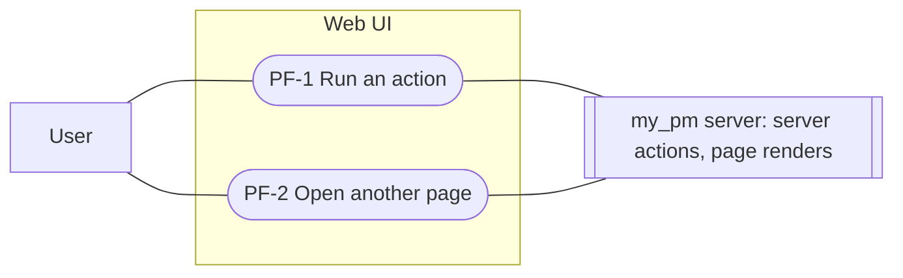

# Pending feedback: use cases

Milestones: PMA-M12 · Updated: 2026-10-03

Every action you start in the web UI and every page you open shows that it's in progress until the server answers,
and an action can't be sent twice by clicking again.

## PF-1 Run an action

- **Actor**: User · **Trigger**: submits a form or uses an inline control that calls a server action (the table below)
- **Preconditions**: the page is loaded; on `/login` and `/signup` auth is on (`JWT_SECRET` set)
- **Main flow**:
  1. The user submits (button, Enter, or ⌘/Ctrl+Enter in the record editor) or uses the control.
  2. The trigger turns pending at once: disabled, `aria-busy="true"`, a spinner next to its label, and a visually
     hidden status naming what's happening (e.g. "Saving…").
  3. The server answers; the trigger goes back to idle and the result shows as it does today (the new state, a
     redirect, or the page refreshed).
- **Alternative and error flows**:
  - PF-1a The user clicks or submits again while pending: nothing is sent.
  - PF-1b The action fails or returns `{ ok: false }`: the trigger goes back to idle and the call site's existing error
    message shows; the user can try again.
  - PF-1c The user prefers reduced motion: the spinner is shown without animating.
- **Postconditions**: each action was sent exactly once per deliberate attempt.

Where it applies:

| Page | Trigger | Server action | Status text |
| --- | --- | --- | --- |
| `/login` | Log in | `login` | Logging in… |
| `/signup` | Sign up | `signUp` | Signing up… |
| every app page (auth on) | Log out | `logout` | Logging out… |
| task | Log | `logTimeAction` | Logging… |
| task page and task tables | status select | `setTaskStatus` | Updating… |
| task | Comment | `addCommentAction` | Adding… |
| task | Delete (a comment) | `deleteCommentAction` | Deleting… |
| task, milestone, project | Save (record editor) | `saveRecordAction` | Saving… |
| task, milestone, project | Reload (record editor, after "Changed elsewhere") | page refresh | Reloading… |
| project | Add (repository) | `addProjectRepoAction` | Adding… |
| project | Remove (repository) | `removeProjectRepoAction` | Removing… |
| task, project | Retry now (sync badge) | `retryGithubSync` | Retrying… |
| connect | Create API key | `createApiKeyAction` | Creating… |
| connect | Revoke | `revokeApiKeyAction` | Revoking… |

| ID | Acceptance criterion | Tests |
| --- | --- | --- |
| PF-1.1 | While a form submit in the table is pending, its submit button is disabled, has `aria-busy="true"` and shows a spinner; afterwards none of these remain | e2e `tests/e2e/pending-feedback.spec.ts` · unit `src/components/ui.test.tsx` |
| PF-1.2 | While an inline action in the table (status select, Delete, Remove, Revoke, Retry now, Reload) is pending, its control is disabled, has `aria-busy="true"` and shows a spinner; afterwards none of these remain | e2e `tests/e2e/pending-feedback.spec.ts` · unit `src/components/ui.test.tsx` |
| PF-1.3 | Clicking the trigger again, or pressing Enter, while the action is pending sends no second request | e2e `tests/e2e/pending-feedback.spec.ts` |
| PF-1.4 | When the action fails, the trigger is idle again and the call site's error message shows | e2e `tests/e2e/pending-feedback.spec.ts` |
| PF-1.5 | The spinner is hidden from assistive technology, and a visually hidden `role="status"` text names the pending action while it runs | e2e `tests/e2e/pending-feedback.spec.ts` · unit `src/components/ui.test.tsx` |
| PF-1.6 | With `prefers-reduced-motion: reduce`, the spinner is visible but not animated | e2e `tests/e2e/pending-feedback.spec.ts` |

## PF-2 Open another page

- **Actor**: User · **Trigger**: follows a link inside the app (nav bar, a task, milestone or project link), changes a
  Gantt filter, or goes back/forward
- **Preconditions**: an app page (`src/app/(app)/`) is loaded
- **Main flow**:
  1. The user follows the link.
  2. A thin progress bar appears at the top of the viewport, and the page area is replaced by a loading skeleton,
     while the nav bar stays.
  3. The new page arrives; the skeleton and the progress bar go away.
- **Alternative and error flows**:
  - PF-2a The new page is ready within about 150 ms (prefetched or cached): the progress bar doesn't appear, so fast
    navigations don't flash.
  - PF-2b The render fails: the error page shows as it does today, and the progress bar goes away.
- **Postconditions**: the UI never looks idle between the click and the new page.

| ID | Acceptance criterion | Tests |
| --- | --- | --- |
| PF-2.1 | Following an app link while the server is slow shows a loading skeleton in the page area before the server answers, with the nav bar still there | e2e `tests/e2e/pending-feedback.spec.ts` |
| PF-2.2 | During a slow navigation a progress bar is visible at the top of the viewport, and it's gone once the new page shows | e2e `tests/e2e/pending-feedback.spec.ts` |
| PF-2.3 | Changing a Gantt filter while the server is slow shows the progress bar until the filtered view shows | e2e `tests/e2e/pending-feedback.spec.ts` |
| PF-2.4 | The loading skeleton has `aria-busy="true"` and a visually hidden "Loading…" status; the progress bar is hidden from assistive technology | e2e `tests/e2e/pending-feedback.spec.ts` |
| PF-2.5 | A navigation that completes within 150 ms never shows the progress bar | e2e `tests/e2e/pending-feedback.spec.ts` |
