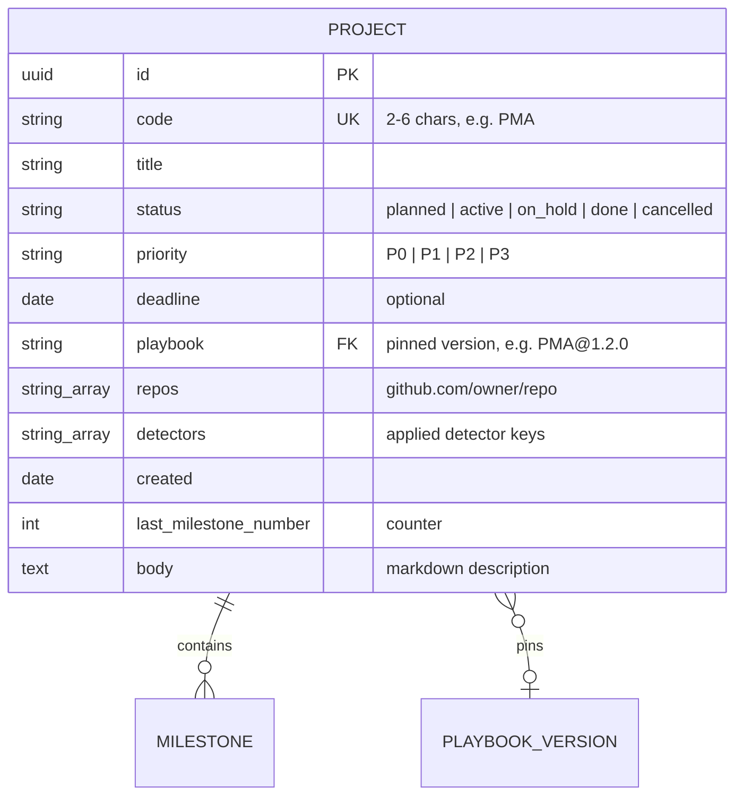

# Personal projects only: data shapes

Milestones: PMA-M17 · Updated: 2026-10-03

The `context` property (`personal` / `company`) is dropped from project definitions. Every project behaves with full personal privileges (GitHub access, full playbook text).



## Project frontmatter

On the file backend (`data/projects/<id>.md`), frontmatter keys match `ProjectMeta` in `src/lib/types.ts`. The `context` key is omitted:

```yaml
---
id: 01924b1e-7f12-7000-8000-000000000001
code: PMA
title: Personal Project Manager
status: active
priority: P1
playbook: sdlc@1.0.0
repos:
  - github.com/user/my_pm
detectors: []
created: 2026-10-03
last_milestone_number: 17
---
Personal project overview and goals.
```

## Postgres row

In the Postgres database, `projects` table columns match `ProjectMeta` plus `body`. The `context` column is removed:

| Column | Type | Constraints / Rules |
| --- | --- | --- |
| `id` | uuid | Primary key, default `uuidv7()` |
| `code` | text | Unique, 2–6 uppercase letters or digits starting with a letter |
| `title` | text | Not null |
| `status` | text | Not null, default `'active'`, check in (`planned`, `active`, `on_hold`, `done`, `cancelled`) |
| `priority` | text | Not null, default `'P2'`, check in (`P0`, `P1`, `P2`, `P3`) |
| `deadline` | date | Nullable |
| `playbook` | text | Foreign key to `playbook_versions(ref)` on delete restrict |
| `repos` | text[] | Not null, default `'{}'` |
| `detectors` | text[] | Not null, default `'{}'` |
| `created` | date | Not null |
| `last_milestone_number` | int | Not null, default `0`, check `>= 0` |
| `body` | text | Not null, default `''` |

## Migration and guard

A new database migration (`NNN_drop_project_context.sql`) drops the column. It includes a pre-check guard to ensure no `company` project silently converts to personal:

```sql
do $$
begin
  if exists (select 1 from projects where context = 'company') then
    raise exception 'Cannot drop projects.context: % company project(s) still exist (projects: %). Reassign or remove them first.',
      (select count(*) from projects where context = 'company'),
      (select string_agg(code, ', ') from projects where context = 'company');
  end if;
end $$;

alter table projects drop column context;
```

If any project still has `context = 'company'`, the migration aborts immediately with an error, rolling back the transaction and leaving the database unchanged.

## Leftover context on the file backend

Existing project files on disk may still contain a `context: personal` (or `context: company`) YAML key:

1. **On read**: `FileRepository.loadDir` parses markdown frontmatter through `ProjectMeta.parse(data)`. Because `context` is no longer declared in the Zod schema, the property is stripped from memory.
2. **On write**: `FileRepository.serialize` filters keys using `Object.keys(META.projects.shape)`. Since `context` is not in the schema keys, it is excluded from the generated YAML, cleanly stripping the leftover key on the next save.

## Pre-change exports

Exports generated before this change contain `context` fields in their project frontmatter:

- During `npm run db:import` (`importInto`), `source.loadAll()` loads projects via `ProjectMeta.parse`, stripping the deprecated `context` property.
- Statements inserting into the `projects` table use `COLUMNS.projects` (`Object.keys(ProjectMeta.shape)` plus `body`), which excludes `context`.
- Pre-change exports import into migrated databases without errors or manual adjustments.
