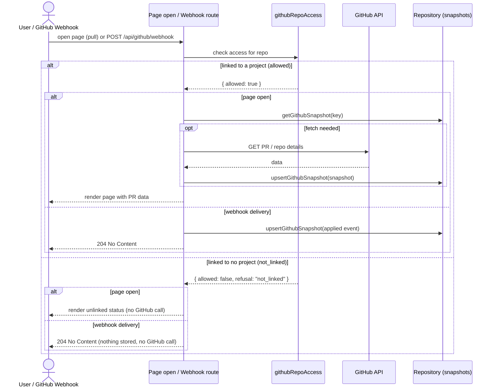
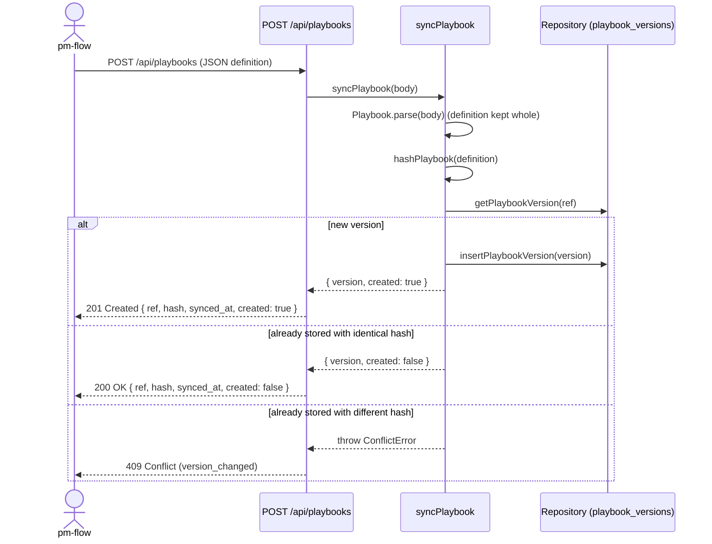

# Personal projects only: sequences

Milestones: PMA-M17 · Updated: 2026-10-03

## The PR read gate

Checked when viewing PR data or receiving webhook deliveries. If a repository is linked to any project, access is allowed; if unlinked, it is refused without contacting GitHub.

## Playbook sync

When `pm-flow` publishes a compiled playbook, `syncPlaybook` validates and stores the definition exactly as sent, keeping all check descriptions, principles, and environment details. No metadata-only stripping occurs.

