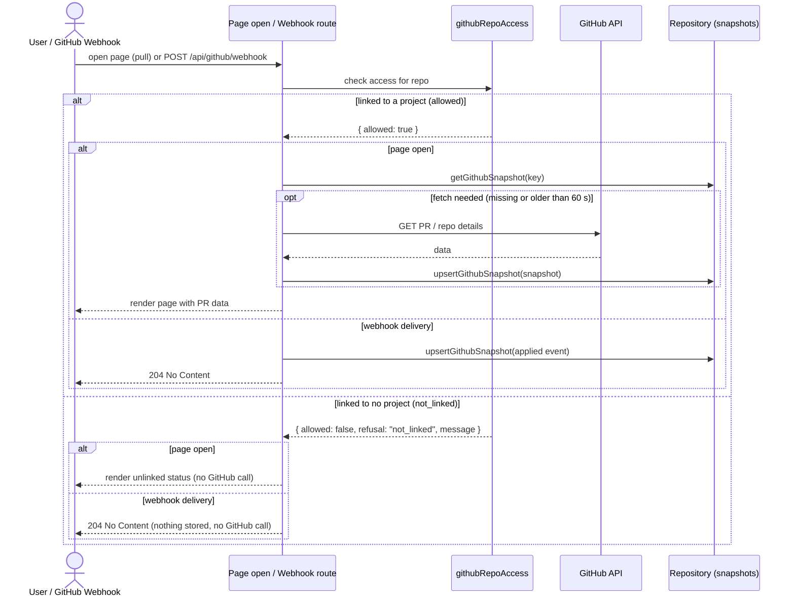
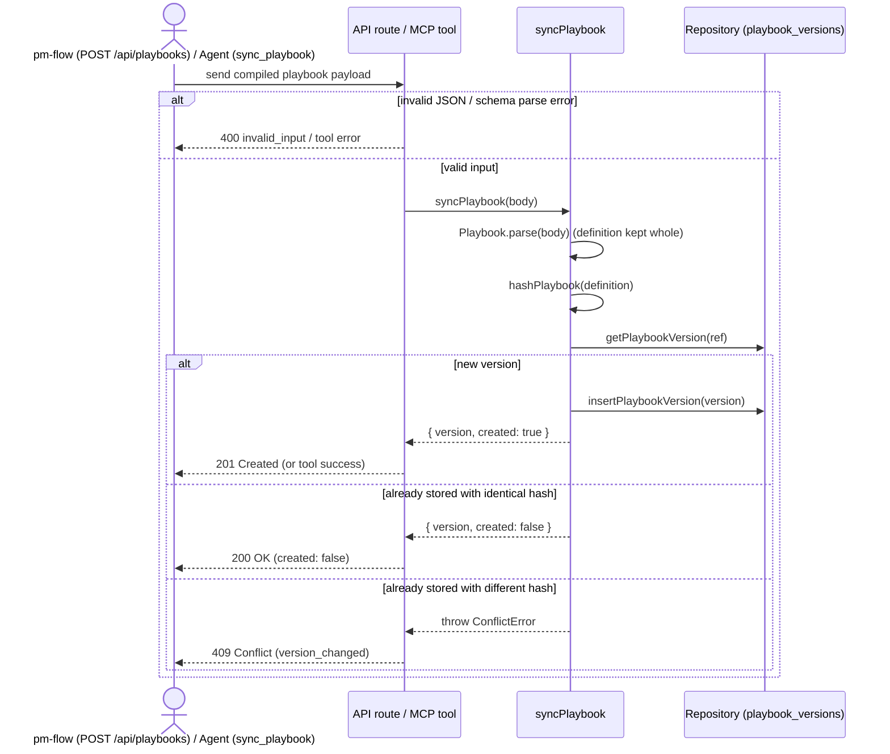

# Personal projects only: sequences

Milestones: PMA-M17 · Updated: 2026-10-03

## PO-1 Dropping the column

`npm run db:migrate` runs migration `008_drop_project_context.sql`. The guard query checks for any company projects; if any exist, it raises an error and rolls back so nothing changes. Otherwise, `projects.context` is dropped. Note that the guard is Postgres-only.

```mermaid
sequenceDiagram
  actor Admin as Developer / CI
  participant Script as npm run db:migrate
  participant DB as Postgres

  Admin->>Script: run db:migrate
  Script->>DB: execute 008_drop_project_context.sql
  DB->>DB: guard: check for projects with context = 'company'
  alt company projects found
    DB-->>Script: raise exception (transaction rollback)
    Script-->>Admin: migration failed; schema and data unchanged
  else no company projects
    DB->>DB: alter table projects drop column context
    DB-->>Script: success
    Script-->>Admin: migration 008 applied
  end
```

## PO-2 The PR read gate

Checked when viewing PR data or receiving webhook deliveries. If a repository is linked to any project, access is allowed; if unlinked, it is refused without contacting GitHub.



## PO-3 Playbook sync

When `pm-flow` publishes a compiled playbook via `POST /api/playbooks` or an agent calls the `sync_playbook` MCP tool, `syncPlaybook` validates and stores the definition exactly as sent, keeping all check descriptions, principles, and environment details. No metadata-only stripping occurs.



## PO-4 No company rules left

PO-4 is checked by grep and a plan sweep at verify, so it has no sequence.
