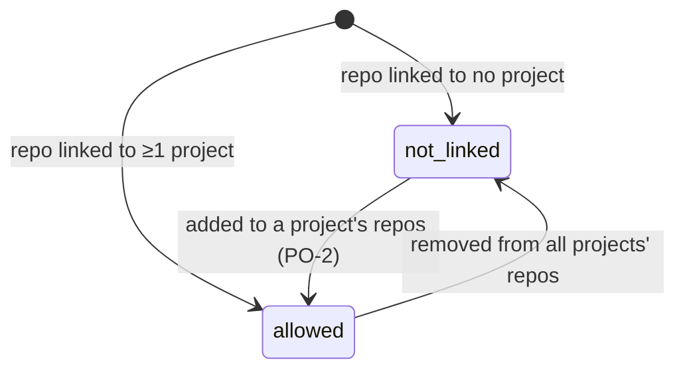

# Personal projects only: states

Milestones: PMA-M17 · Updated: 2026-10-03

GitHub access for a repository is simplified: being linked to a project means access is allowed; being linked to no project means access is refused as `not_linked`. The previous `company` refusal state is removed.

| State | Result | Condition | Effect |
| --- | --- | --- | --- |
| `allowed` | `{ allowed: true }` | The repository remote (`github.com/owner/repo`) is present in at least one project's `repos` | GitHub API calls permitted: PRs synced on page view, snapshots updated by webhook events |
| `not_linked` | `{ allowed: false, refusal: "not_linked" }` | The repository remote is not present in any project's `repos` | External GitHub calls refused: UI displays unlinked status, webhooks acknowledge 204 without storing data |

Every project in my_pm is personal. There is no `company` context to restrict GitHub communication.
