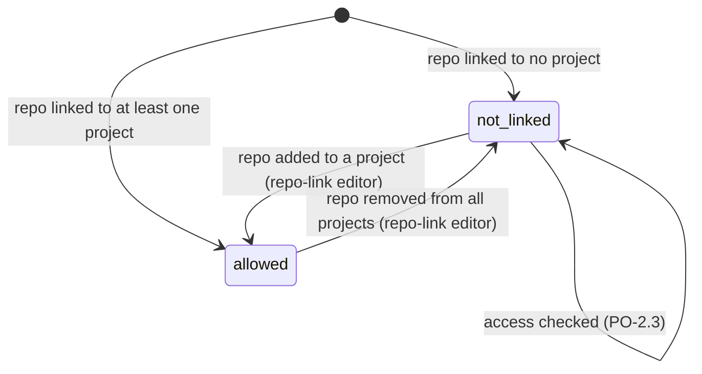

# Personal projects only: states

Milestones: PMA-M17 · Updated: 2026-10-03

GitHub access for a repository is simplified: being linked to a project means access is allowed; being linked to no project means access is refused as `not_linked`. The previous `company` refusal state is removed.

## GitHub access

| From | To | Use case | Guard | Effect |
| --- | --- | --- | --- | --- |
| — | not_linked | — | Repo remote not linked to any project | Refused immediately: `{ allowed: false, refusal: "not_linked", message }` |
| — | allowed | — | Repo remote linked to at least one project | Access permitted: `{ allowed: true }` |
| not_linked | allowed | repo-link editor | User adds repo remote to a project | Repo gains GitHub access across my_pm |
| allowed | not_linked | repo-link editor | User removes repo remote from all projects | Repo loses GitHub access |
| not_linked | not_linked | PO-2.3 | External call attempted (page open, webhook, or PR reference) | Refused without GitHub call: returns `{ allowed: false, refusal: "not_linked", message }` |

There is no `company` state any more. Every project in my_pm is personal, so every linked repository is allowed and only unlinked repositories are refused.
