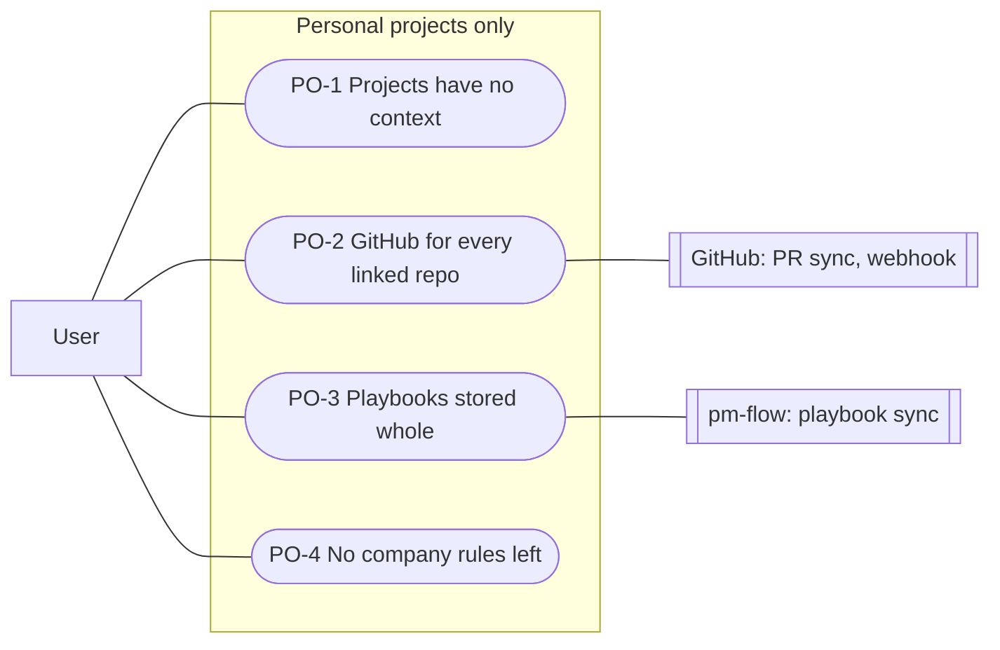

# Personal projects only: use cases

Milestones: PMA-M17 · Updated: 2026-10-03

my_pm is for personal projects only. The `context` field (`personal` / `company`) is removed, so every project behaves the way a personal project does today: PRs are accepted for every linked repository, playbooks are stored whole with check text, and no tool, page or export exposes a company concept.

## PO-1 Projects have no context

I create and update projects without a context, and no tool, page or export shows one.

- **Actor**: User · **Trigger**: creates, updates, reads, or migrates/exports/imports a project
- **Preconditions**: user is authorized; on the Postgres backend, no project has `context = 'company'` before running the migration
- **Main flow**:
  1. The user creates or updates a project via MCP tools (`create_project`, `update_project`) or the web UI without supplying a `context`.
  2. The system stores the project without any `context` attribute (in Postgres, `projects.context` is dropped; on the file backend, `context:` is absent from frontmatter).
  3. Retrieval tools and views (`list_projects`, `get_project`, `get_lifecycle`, UI pages, and exports) return and display project records without a context field.
- **Alternative and error flows**:
  - PO-1a File backend with a leftover `context:` key: the project loads normally (unknown key ignored), and the key is removed on the next write.
  - PO-1b Pre-change export imported: legacy exports containing `context` import cleanly without error.
  - PO-1c Migration run while any project still has `context = 'company'`: the migration raises an exception and aborts without altering the schema or data.
- **Postconditions**: no project record in memory, on disk, in Postgres, or in tool output contains a `context` field.

| ID | Acceptance criterion | Tests |
| --- | --- | --- |
| PO-1.1 | `create_project` and `update_project` have no `context` parameter, and `list_projects`, `get_project` and `get_lifecycle` return none | unit `src/lib/repo.test.ts` · unit `src/lib/lifecycle-api.test.ts` · unit `src/lib/mcp/server.test.ts` |
| PO-1.2 | The migration drops `projects.context`, and refuses (changing nothing) while a project is still company | unit `src/lib/migrate.test.ts` · unit `src/lib/repo.test.ts` |
| PO-1.3 | On the file backend, a project file with a leftover `context:` key still loads, and loses the key on its next write | unit `src/lib/repo.test.ts` |
| PO-1.4 | An export taken before the change still imports | unit `src/lib/repo.test.ts` |

## PO-2 GitHub for every linked repo

A task takes PRs from any repo linked to its project. Pages and `get_task` show them, and the webhook stores events for every linked repo.

- **Actor**: User or GitHub Webhook · **Trigger**: sets `prs` on a task, opens a task/project page, calls `get_task`, or delivers a GitHub webhook event
- **Preconditions**: the target repository is listed in the project's `repos`
- **Main flow**:
  1. The user associates PR references (e.g. `owner/repo#123`) with a task via `update_task` or the record editor.
  2. `assertPrsFit` checks that the repository is linked to the task's project; since every project supports GitHub, the PR reference is accepted.
  3. When viewing the task (`get_task` or opening the page), `githubRepoAccess` confirms the repo is linked and pulls/syncs PR details.
  4. When GitHub sends a webhook event for any linked repository, `githubRepoAccess` confirms the repo is linked and updates the snapshot.
- **Alternative and error flows**:
  - PO-2a PR repo not linked to project: `assertPrsFit` rejects the PR with `PrReferenceError` prompting the user to link the repository.
  - PO-2b GitHub access checked for unlinked repo: `githubRepoAccess` returns `{ allowed: false, refusal: "not_linked" }`; no GitHub API call is made, and webhooks acknowledge with 204 without storing data.
- **Postconditions**: all linked repositories have full GitHub synchronization; unlinked repositories never trigger external GitHub calls.

| ID | Acceptance criterion | Tests |
| --- | --- | --- |
| PO-2.1 | A PR from a repo linked to the task's project is accepted on every project | unit `src/lib/repo.test.ts` |
| PO-2.2 | That PR is synced on page open and by the webhook | unit `src/lib/github/pull.test.ts` · unit `src/lib/github/webhook.test.ts` |
| PO-2.3 | A repo linked to no project is still refused (`not_linked`), with no GitHub call | unit `src/lib/repo.test.ts` · unit `src/lib/github/pull.test.ts` · unit `src/lib/github/webhook.test.ts` |

## PO-3 Playbooks stored whole

A synced playbook keeps its check, principle and environment text, whatever its name or layers.

- **Actor**: User / pm-flow · **Trigger**: syncs a playbook via `POST /api/playbooks` or `syncPlaybook`
- **Preconditions**: caller is authenticated (API key or session cookie)
- **Main flow**:
  1. pm-flow sends a compiled playbook payload (JSON) to `POST /api/playbooks`.
  2. `syncPlaybook` validates the definition against the `Playbook` schema and stores it in full, retaining all check, principle, and environment text regardless of layer names.
  3. `get_lifecycle` displays check text on every project evaluated against this playbook.
- **Alternative and error flows**:
  - PO-3a Re-syncing an identical version ref and content succeeds with `{ created: false }`.
  - PO-3b Syncing different content under an existing version ref returns 409 `version_changed`.
- **Postconditions**: stored playbook definitions retain complete text descriptions; lifecycle views render check text across all projects.

| ID | Acceptance criterion | Tests |
| --- | --- | --- |
| PO-3.1 | A playbook compiled from a layer named `company` is stored with its text | unit `src/lib/repo.test.ts` |
| PO-3.2 | `get_lifecycle` shows check text on every project | unit `src/lib/lifecycle-api.test.ts` · unit `src/lib/lifecycle.test.ts` |

## PO-4 No company rules left

Code, docs, agent instructions, the playbooks repo and open plans describe personal projects only.

- **Actor**: Developer / Agent · **Trigger**: checks documentation, agent guidelines, code repositories, and project plans
- **Preconditions**: PMA-M17 changes have been applied
- **Main flow**:
  1. Documentation, agent instructions, and codebase comments describe my_pm as a personal project manager without company exceptions.
  2. All company-specific code branches, privacy guards, and metadata-stripping logic are removed.
  3. No open PMA or PLAY plan asks for company behaviour, PMA-M14 is cancelled, and built milestones (PMA-M6, PMA-M9, PLAY-M1) keep their specs as history.
- **Alternative and error flows**:
  - PO-4a Historical migration files, `.claude/.notes/`, and playbook CHANGELOGs preserve historical records of earlier milestones.
- **Postconditions**: search tools find no occurrences of `company` in active code and instructions.

| ID | Acceptance criterion | Tests |
| --- | --- | --- |
| PO-4.1 | `grep -rniI company` finds nothing in my_pm's `src/`, `tests/`, `README.md` and `CLAUDE.md`, or in the playbooks repo outside its CHANGELOGs. Applied migrations and `.claude/.notes/` keep their history | check: grep -rniI company (verify) |
| PO-4.2 | No open PMA or PLAY plan asks for company behaviour, and PMA-M14 is cancelled. Built milestones (PMA-M6, PMA-M9, PLAY-M1) keep their specs as history. | check: plan sweep in my_pm (verify) |
